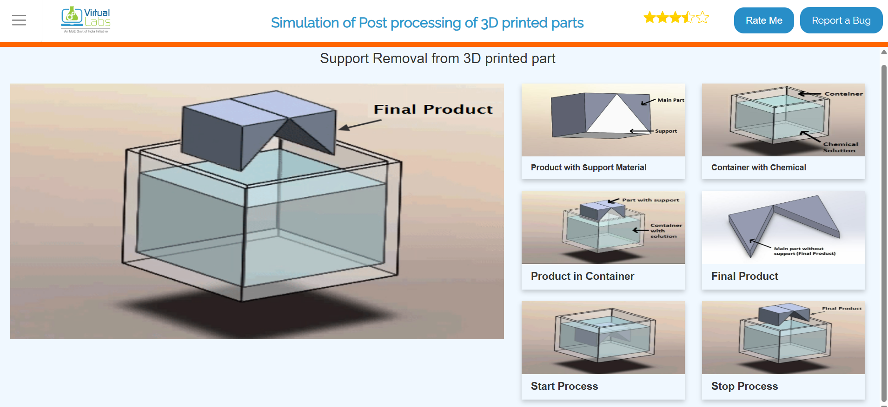

# Ex.No.9- SIMULATION OF POST PROCESSING IN ADDITIVE MANUFACTURING

### DATE: 14.12.25

## AIM: 
### To simulate the post processing of 3d printed parts via support Removal, UV Curing & Heat Treatment.

## REQUIREMENTS:
### System - Windows 7 or higher, 1 GB RAM.

## PROCEDURE:

## Procedure for support removal
### 1.	Select support removal from the list.
### 2.	All the parts related to support removal are shown on the screen.
### 3.	Select the parts in sequence in which they are shown.
### 4.	When the first part is selected then it will open in the blank space in the left side of the screen.
### 5.	If the user follows an incorrect sequence then a pop-up will appear on the screen showing the name of the part to be selected.

## Procedure for UV Curing
### 1.	Select UV curing from the list.
### 2.	All the parts related to UV curing are shown on the screen.
### 3.	Select the parts in sequence in which they are shown.
### 4.	When the first part will be selected then it will open in the blank space on the left side of the screen.
### 5.	If the user follows an incorrect sequence then a pop-up will appear on the screen showing the name of the part to be selected.

## Procedure for heat treatment
### 1.	Select heat treatment from the list.
### 2.	All the parts related to heat treatment are shown on the screen.
### 3.	Select the parts in sequence in which they are shown.
### 4.	When the first part is selected then it will open in the blank space in the left side of the screen.
### 5.	If the user follows an incorrect sequence then a pop-up will appear on the screen showing the name of the part to be selected.

## OUTPUT :

## Support Removal Process

## UV Curing of 3D printed part

## Heat Treatment of 3D printed part

## Output:

### Name: YUVASRI V
### Register Number: 25008890

## Result: 
### Thus the simulation on the Postprocessing in additive manufacturing is completed.
